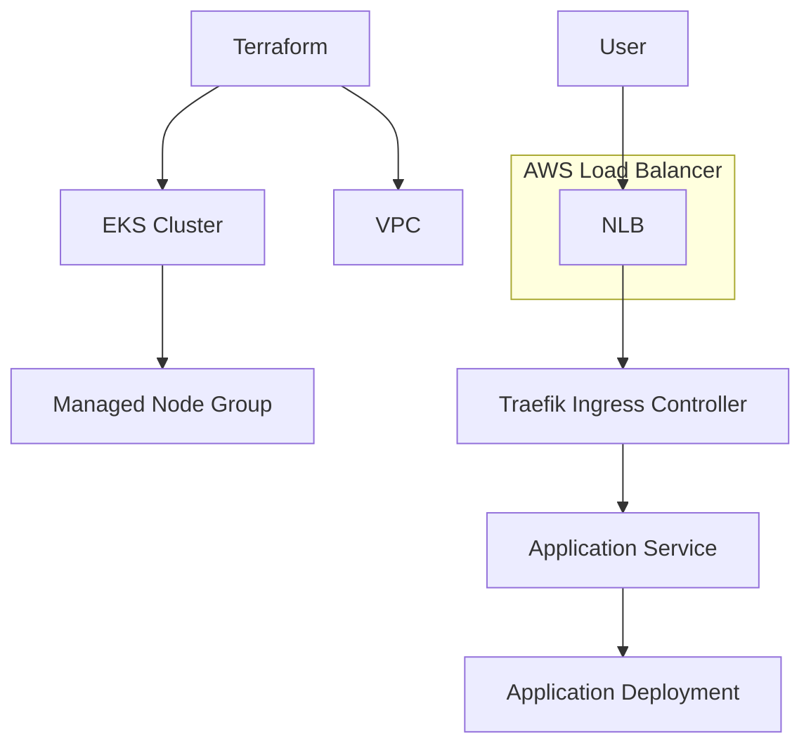
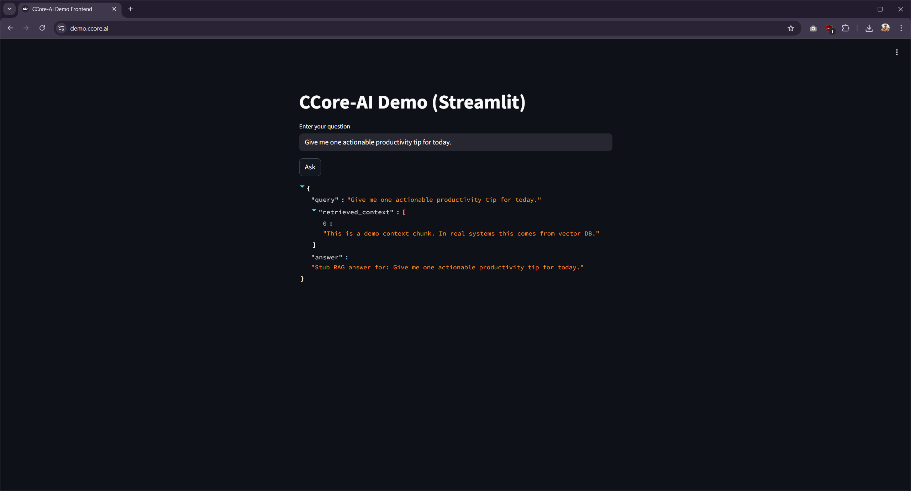
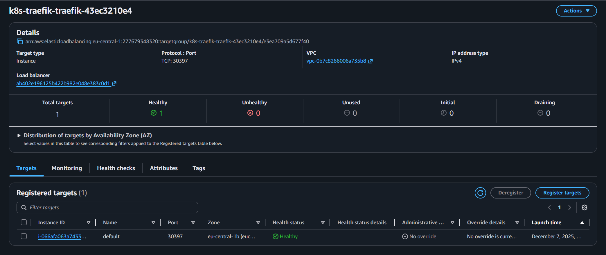
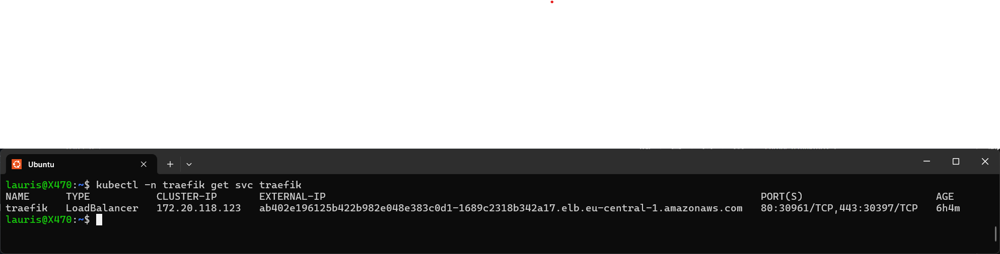
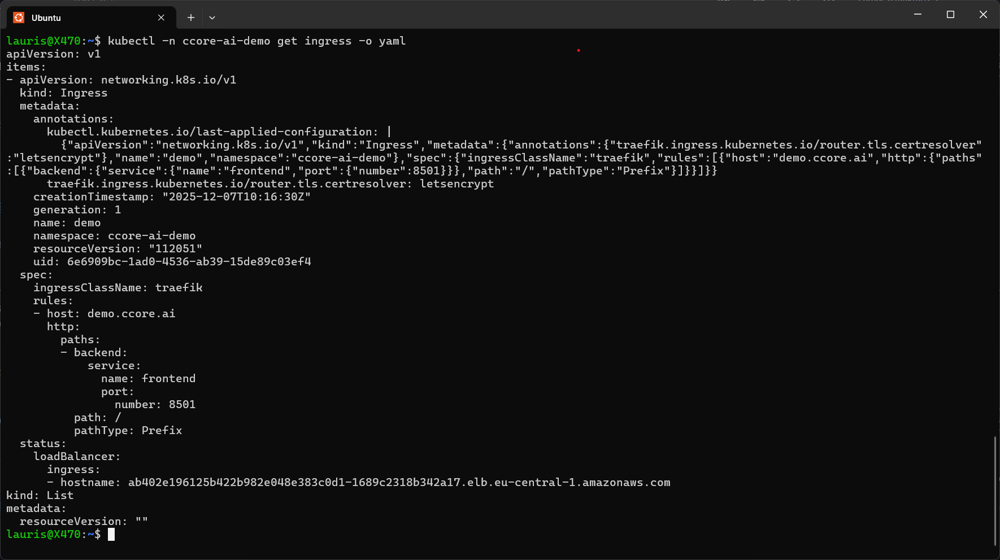
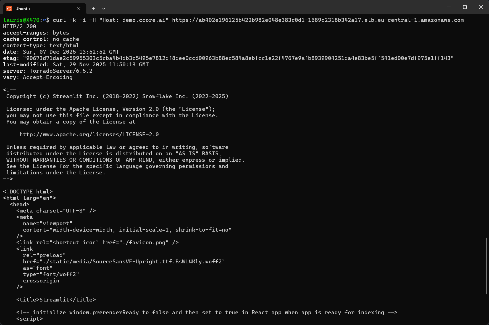

# AWS EKS Platform — Terraform + Kubernetes (Traefik) Platform Architecture

This repository contains a **production-aligned AWS EKS platform**, designed to demonstrate strong Infrastructure Engineering, SRE and Cloud Architecture capabilities.

The stack includes:

- **Terraform IaC** (AWS VPC + EKS cluster using official modules)
- **Kubernetes ingress layer using Traefik (NLB-based)**
- **Application onboarding using Kustomize**
- **Modular directory structure matching real-world platform engineering standards**
- **Verifiable end-to-end routing: NLB → Traefik → Service → Pod**

---

# 1. Platform Overview

The platform is composed of two major layers:

## Terraform Layer (`terraform/`)
Responsible for provisioning AWS infrastructure:

- **VPC** (public + private subnets, NAT, routing)
- **EKS Cluster** (terraform-aws-modules/eks v21)
- **Managed Node Groups** (AL2023)
- **IAM roles + IRSA**
- **Security Group rule enhancements for NLB → NodePort**

## Kubernetes Layer (`k8s/`)
Defines cluster workloads:

- **Traefik Ingress Controller (Helm)**
- **Demo application (Deployment + Service + Ingress)**
- **Kustomize-based environment structure**

The platform is directly usable as a **demo**, **training environment**, or **foundation for more advanced production features**.

---

# 2. Architecture Diagram



Full low-level version (modules + cloud-init + Ansible roles + containers):

[Full architecture diagram](diagrams/architecture.mmd)

---

# 3. Repository Structure

```
aws-eks-platform/
├── terraform/                     # AWS IaC (VPC, EKS, Node Groups)
│   └── envs/                      # Environment-specific configs (dev, prod, etc.)
│
├── k8s/                           # Kubernetes manifests and component definitions
│   └── base/
│       ├── traefik/               # Ingress Controller (Helm values + configs)
│       └── ccore-ai-demo/         # Demo application resources
│
├── diagrams/                      # Mermaid architecture diagrams
│
├── .github/workflows/             # GitHub Actions CI/CD pipelines'
└── README.md                      # Kubernetes overview
```

---

# 4. Terraform Architecture

## Modules Used
- **terraform-aws-modules/vpc v6**
- **terraform-aws-modules/eks v21**
- **Additional custom SG rules** for NLB → NodePort connectivity

## Key Features
- Private subnets for nodes  
- Public subnets with correct LB tags  
- IAM access entries for cluster admins  
- IRSA enabled for workload identity  
- Security groups left unmodified where AWS recommends

## Deployment Workflow

```
cd terraform/envs/dev
terraform init
terraform apply
```

Retrieve kubeconfig:

```
aws eks update-kubeconfig --name <cluster-name>
kubectl get nodes
```

---

# 5. Kubernetes Layer

## Ingress Layer – Traefik

Traefik is deployed via Helm with:

- **AWS NLB** (`service.beta.kubernetes.io/aws-load-balancer-type: nlb`)
- **HTTPS enforcement**
- **ACME/Let's Encrypt support**
- **IngressClass definition**

Deployment:

```
helm repo add traefik https://traefik.github.io/charts
helm repo update

kubectl create namespace traefik

helm install traefik traefik/traefik \
  --namespace traefik \
  --version 37.4.0 \
  --values k8s/base/traefik/values.yaml
```

## Application – ccore-ai-demo

Includes:

- `Deployment`
- `Service (ClusterIP)`
- `Ingress` routed through Traefik
- Namespace isolation
- Delivered via Kustomize

Deployment:

```
kubectl apply -k k8s/base/ccore-ai-demo
```

---

# 6. Full Routing Path

The platform provides a complete, verifiable network path:

```
Client → AWS NLB → Traefik → Ingress Rule → Service → Pod
```

Validate routing:

```
curl -k -H "Host: demo.ccore.ai" https://<NLB-DNS>
kubectl logs -n traefik -l app.kubernetes.io/name=traefik
kubectl logs -n ccore-ai-demo -l app=ccore-ai-demo
```

---

# 7. Security Model

- Nodes run in **private subnets**
- Traefik exposed via **public NLB**
- Node SG extended for NLB → NodePort
- IRSA enabled for workload identity
- Default SG left unmanaged (AWS EKS requirement)
- HTTPS via ACME certificates
- No workloads have public IPs

---

# 8. Observability & Extensibility

| Feature | Status |
|--------|--------|
| Metrics server | Standard in EKS |
| Prometheus/Grafana | Optional, easy integration |
| External DNS | Optional |
| HPA / Autoscaling | Supported |
| Logging stack | Can be added (Loki / ELK) |

---

# 9. Verification — End-to-End Proof

## 9.1 Browser — demo.ccore.ai



---

## 9.2 AWS Target Group — healthy nodes



---

## 9.3 Traefik Service (Kubernetes)



---

## 9.4 Ingress rule (Host-based routing)



---

## 9.5 CLI validation (curl with Host header)



---

# 10. Roadmap

- Prometheus + Grafana bundle  
- ExternalDNS  
- HPA autoscaling examples  
- Service Mesh (Linkerd / Istio)  

---

# 11. Why This Repository Matters

This repository showcases a real-world AWS EKS platform built with Terraform, Kubernetes and Traefik, including secure networking, private node subnets, NLB-based ingress, and end-to-end routing validation. It demonstrates the practical skill set required for modern Infrastructure, SRE and Platform Engineering roles: cloud-native architecture design, production-aligned IaC, and verifiable, working infrastructure rather than theoretical examples.

---

# 12. License

MIT
