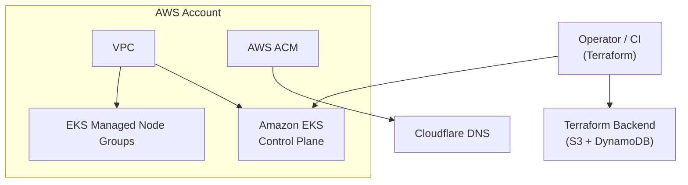

# AWS EKS Terraform Platform — Infrastructure Foundation

**Production-aligned · API-Only Authentication · Cloudflare-Integrated · GitOps-Ready**

This repository implements a **production-aligned AWS infrastructure foundation** for running Kubernetes workloads on **Amazon EKS**, provisioned entirely via **Terraform**.

It provides a **clean, explicit, and auditable infrastructure layer** designed to be consumed by a **separate GitOps / workload lifecycle repository**, mirroring how modern platform teams split responsibilities in real production environments.

This repository is the **authoritative source of truth for AWS infrastructure**.

---

## Purpose & Scope

The goal of this repository is to deliver a **stable, minimal, and extensible EKS foundation**, not a demo cluster.

It focuses on:

- Correct AWS primitives
- Explicit authentication and access model
- Deterministic networking and security boundaries
- Automation-first certificate and DNS handling
- Clear dev → prod evolution path

Everything **above the cluster** (platform services, workloads, GitOps logic) is intentionally **out of scope**.

---

## Architectural Principles

The infrastructure design prioritizes:

- Explicit ownership of infrastructure lifecycle
- IAM-native, API-only Kubernetes authentication
- Minimal moving parts at the infrastructure layer
- Separation of infrastructure and cluster lifecycle concerns
- Cost-aware defaults without compromising production parity

The result is an infrastructure layer that is **boring, predictable, and safe** — by design.

---

## Terraform Backend Bootstrap

This infrastructure uses a **pre-bootstrapped, shared Terraform backend** based on **S3 + DynamoDB**, created and managed via a **dedicated bootstrap repository**.

**Terraform backend bootstrap (authoritative):**  
https://github.com/LaurisNeimanis/aws-tf-backend-bootstrap

That repository is responsible for **one-time creation** of:

- A globally unique S3 bucket for Terraform state
- A DynamoDB table for state locking
- Versioning, encryption, and public access blocking

After the bootstrap step is completed once, **all Terraform environments** (global, dev, prod) automatically use this backend.

This repository **does not create or modify backend infrastructure** — it only consumes it.

---

## Core Technologies (Actual Implementation)

- **AWS VPC** — `terraform-aws-modules/vpc` v6  
- **Amazon EKS** — `terraform-aws-modules/eks` v21  
- **EKS Managed Node Groups** (Amazon Linux 2023)  
- **EKS Access API** (API-only authentication mode)  
- **AWS ACM** — DNS-validated certificates  
- **Cloudflare DNS** — automated ACM validation records  
- **S3 Gateway VPC Endpoint**  
- **S3 + DynamoDB** remote Terraform backend (bootstrapped externally)  
- **Cost-optimized NAT** (single NAT for dev environments)

No legacy components. No implicit defaults.

---

## Responsibility Split

### In scope

- AWS VPC and subnet topology
- Internet Gateway, NAT, and routing
- EKS control plane
- Managed node groups
- IAM roles and access model
- ACM certificates
- Cloudflare DNS automation
- Terraform state consumption and locking

### Out of scope

- Terraform backend creation (S3, DynamoDB)
- Kubernetes workloads
- GitOps tooling (ArgoCD, ApplicationSets)
- Ingress controllers
- DNS routing for applications
- CI/CD pipelines
- Runtime secrets

Related repositories:

- **Terraform backend bootstrap:** https://github.com/LaurisNeimanis/aws-tf-backend-bootstrap  
- **GitOps layer:** https://github.com/LaurisNeimanis/aws-eks-gitops

---

## Repository Structure

```text
terraform/
└── envs/
    └── dev/
        ├── backend.tf
        ├── versions.tf
        ├── providers.tf
        ├── variables.tf
        ├── terraform.tfvars.example
        ├── locals.tf
        ├── vpc.tf
        ├── vpc-endpoints.tf
        ├── eks.tf
        ├── acm.tf
        ├── acm-dns-cloudflare.tf
        ├── acm-validation.tf
        └── outputs.tf
```

Each environment is **fully self-contained**, but relies on the **shared, pre-created Terraform backend**.

---

## Architecture Overview



> This is a high-level platform overview.  
>  
> A detailed infrastructure and networking diagram is available here:  
> **[diagrams/architecture.mmd](diagrams/architecture.mmd)**

---

## Terraform Workflow

```bash
cd terraform/envs/dev
terraform init
terraform plan
terraform apply
```

The backend is **already provisioned** and referenced in `backend.tf`.

---

## Terraform CI (Quality Gates)

This repository includes a **GitHub Actions–based Terraform CI pipeline** that enforces
**formatting, linting, security scanning, and validation** on all Terraform changes.

The CI pipeline is intentionally **non-deploying**.

It exists solely to ensure that:

- Terraform code remains syntactically valid
- Formatting is consistent and deterministic
- Common misconfigurations are caught early
- Security issues are flagged before merge
- Infrastructure definitions stay reviewable and safe

### What the CI does

On every pull request and on pushes to `main` (Terraform paths only), the pipeline runs:

- `terraform fmt -check` (repo-wide)
- `terraform init` (without backend, CI-safe)
- `terraform validate`
- `tflint` (static analysis)
- `tfsec` (security scanning)

A minimal `terraform.tfvars` is provisioned automatically in CI using
`terraform.tfvars.example` to allow validation without secrets.

### What the CI does NOT do

- No `terraform plan`
- No `terraform apply`
- No backend access
- No environment mutation

All infrastructure changes are still applied **manually or via controlled pipelines**
outside of this repository.

This keeps the infrastructure layer **safe, auditable, and review-driven**.

---

## Design Summary

This repository provides a **clean, production-aligned EKS infrastructure foundation** with:

- IAM-native, API-only authentication
- Explicit networking and security boundaries
- Fully automated ACM + Cloudflare integration
- Shared, pre-bootstrapped Terraform backend
- Deterministic Terraform workflows
- Clear separation from GitOps and workload concerns

It is intentionally designed to be **boring infrastructure** — so higher layers can evolve safely.
