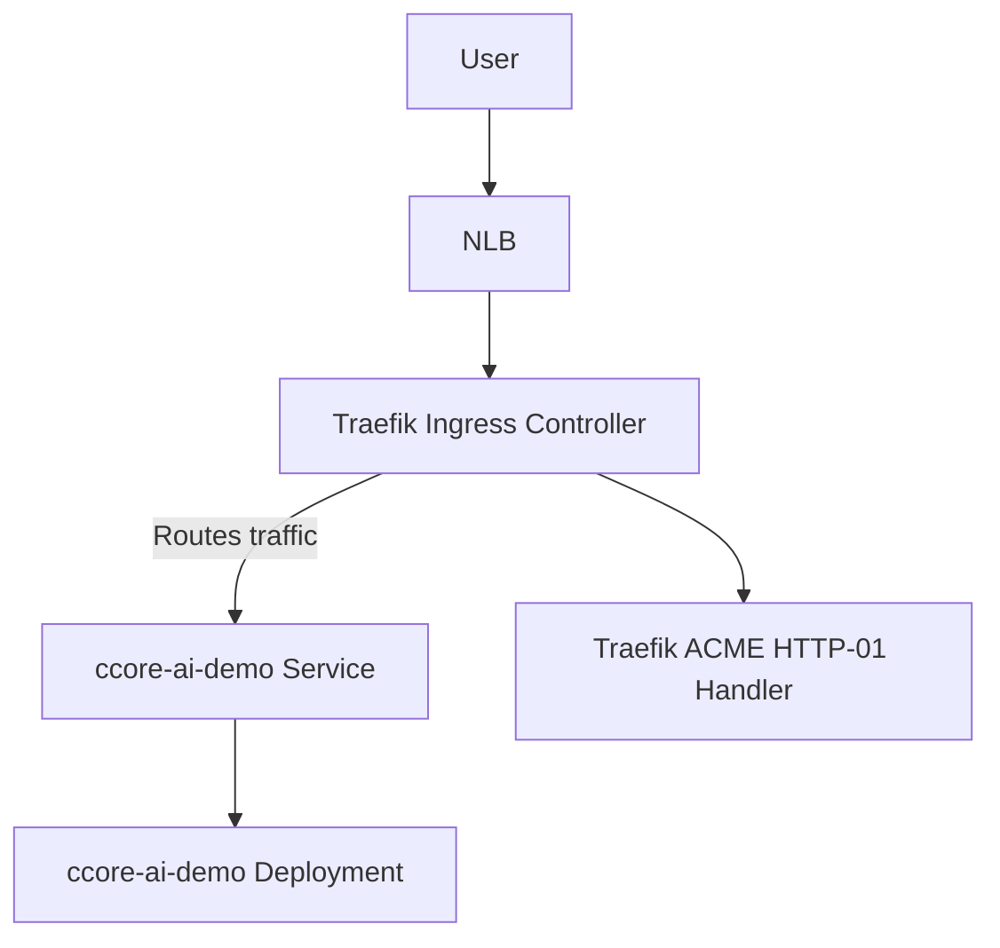

# Kubernetes Demo Environment (EKS + Traefik + Applications)

This directory contains a **clean, production-aligned Kubernetes deployment structure** used for demonstrating how to run workloads on **AWS EKS** with **Traefik** as the ingress controller and **Kustomize** as the application packaging method.

The structure replicates modern **SRE / Platform Engineering** deployment patterns.

---

# 1. Directory Structure

```
k8s/
├── base/
│   ├── traefik/
│   │   ├── values.yaml            # Traefik Helm values (NLB, TLS, ACME-ready)
│   │   └── README.md              # Component documentation
│   │
│   ├── ccore-ai-demo/
│   │   ├── namespace.yaml         # Namespace isolation
│   │   ├── deployment.yaml        # Application Deployment
│   │   ├── service.yaml           # ClusterIP service (backend for Traefik)
│   │   ├── ingress.yaml           # Domain routing configuration
│   │   └── kustomization.yaml     # Kustomize bundle
│   │
│   └── ...
│
└── README.md                      # (this file)
```

---

# 2. High-Level Architecture



**Flow Explanation:**

- The **AWS Network Load Balancer** forwards traffic directly to Traefik pods.
- **Traefik** performs TLS termination, hostname routing, redirects, and ACME challenges.
- Traffic is routed to the appropriate **Service** and then forwarded to **Pods** inside the Deployment.

This reflects a typical production ingress architecture, simplified for demo purposes.

---

# 3. Component Overview

## 3.1 Traefik (Ingress Controller)  
Location: `k8s/base/traefik/values.yaml`

Configured with:

- **AWS NLB** (`service.beta.kubernetes.io/aws-load-balancer-type: "nlb"`)
- **HTTP → HTTPS redirect**
- **ACME (Let’s Encrypt) certificate resolver**
- **Stateless ACME mode** (`persistence: false`) for simplified demos  
- **Default ingress class**: `traefik`

This configuration mirrors a realistic ingress setup, with performance, simplicity, and demo completeness balanced correctly.

---

## 3.2 Namespace

Provides workload isolation.

```yaml
apiVersion: v1
kind: Namespace
metadata:
  name: ccore-ai-demo
```

---

## 3.3 Deployment

Defines the application container, replica count, and resource configuration.

Key elements:

- **Labels** for routing  
- **Health probes**  
- **Resource requests/limits**  
- **Stateless container model**, as expected in cloud-native workloads  

---

## 3.4 Service

Exposes the Deployment inside the cluster:

```yaml
type: ClusterIP
port: 8501
```

This acts as a stable backend target for Traefik.

---

## 3.5 Ingress

Defines routing rules:

```yaml
spec:
  ingressClassName: traefik
  rules:
    - host: demo.ccore.ai
      http:
        paths:
          - path: /
            backend:
              service:
                name: frontend
                port: 8501
```

Traefik handles:

- TLS termination  
- HTTP routing  
- Path and hostname rules  
- ACME HTTP-01 challenges  

---

# 4. Kustomize Flow

`kustomization.yaml` composes the application stack:

```
resources:
  - namespace.yaml
  - deployment.yaml
  - service.yaml
  - ingress.yaml
```

Apply the full setup via:

```
kubectl apply -k k8s/base/ccore-ai-demo
```

This method is reproducible, declarative, and aligns with GitOps workflows.

---

# 5. Deployment Workflow

### 1) Deploy Traefik

```
helm repo add traefik https://traefik.github.io/charts
helm repo update

kubectl create namespace traefik

helm install traefik traefik/traefik \
  --namespace traefik \
  --version 37.4.0 \
  --values k8s/base/traefik/values.yaml
```

### 2) Deploy the application

```
kubectl apply -k k8s/base/ccore-ai-demo
```

### 3) Verify state

```
kubectl get pods -n ccore-ai-demo
kubectl get ingress -n ccore-ai-demo
kubectl -n traefik logs -l app.kubernetes.io/name=traefik
```

### 4) Access the demo

```
https://demo.ccore.ai
```

---

# 6. Production Considerations

| Feature | Demo Mode | Production |
|--------|-----------|------------|
| Traefik ACME storage | In-memory | Persistent (EBS/EFS or S3) |
| Traefik replicas | 1 | 2+ (HPA recommended) |
| Load Balancer | NLB | NLB or ALB depending on requirements |
| Logging | Basic | Structured / Centralized (Loki, ELK) |
| Metrics | Built-in Traefik metrics | Full Prometheus stack |
| App resources | Minimal | Guaranteed QoS (requests/limits tuned) |
| Secret management | Inline | External (AWS Secrets Manager / SOPS) |
| TLS policy | Automatic | Full certificate and cipher policy enforcement |

This communicates **deep understanding of production vs. demo constraints**, which employers immediately notice.

---

# 7. Summary

This Kubernetes demo environment demonstrates:

- Clean and professional SRE-oriented directory layout  
- Traefik as a modern ingress controller fully integrated with EKS  
- Domain-based routing with TLS termination  
- Proper Service/Deployment separation  
- Kustomize for environment reproducibility  
- A workflow identical to real production onboarding pipelines  
