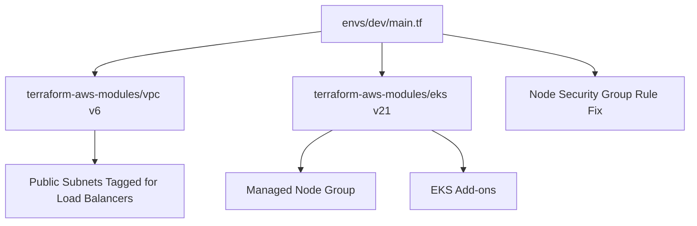

# Terraform AWS Infrastructure — EKS-Based, Modular & Production-Grade

This directory provides a **clean, production-aligned Terraform Infrastructure-as-Code implementation** for deploying an AWS-based Kubernetes platform using:

- **AWS VPC** (terraform-aws-modules/vpc v6)  
- **EKS Cluster** (terraform-aws-modules/eks v21)  
- **Managed Node Group**  
- **Node Security Group enhancement for NLB → NodePort traffic**  
- **Strict, consistent tagging and naming across resources**

The structure follows modern **SRE / Cloud Architecture** practices:

- Clear separation between **environment configuration** and **module logic**  
- Minimal surface area, maximum clarity  
- Predictable, reproducible IaC  
- Easily extendable into multi-AZ, multi-environment, or GitOps-driven deployments  

---

## **1. Directory Structure**

```
terraform/
├── README.md
└── envs/
    └── dev/
        ├── backend.tf
        ├── providers.tf
        ├── main.tf
        ├── eks-node-sg.tf
        ├── variables.tf
        ├── terraform.tfvars
        ├── terraform.tfvars.example
        └── outputs.tf
```

---

## **2. Architecture Diagram**



---

## **3. Purpose of This Infrastructure**

This setup provides:

- A **minimal but production-aligned AWS environment**
- A **fully functional EKS cluster** ready for workloads and ingress controllers
- A **networking and security model aligned with AWS best practices**
- Full compatibility with **Traefik on an AWS Network Load Balancer (NLB)**
- A clean, reproducible platform suitable for real-world SRE and platform engineering use cases

---

## **4. Integration Layer (envs/dev)**

The `envs/dev` configuration connects all components into a single working system:

- **VPC module → EKS module wiring**
- **Private subnets → EKS nodes placement**
- **Node Security Group fix → NLB → NodePort compatibility**
- **IAM access entries via `admin_principal_arn`**
- **Outputs used by kubectl / Helm tooling**

After running:

```
terraform apply
```

the environment provides a ready-to-use EKS cluster with correct networking, routing, node placement, and load balancer compatibility.

---

## **5. High-Level Components**

### **Networking (VPC Module v6)**
- VPC CIDR
- Public and private subnets
- Internet Gateway + route tables
- NAT Gateway (cost-optimized single NAT for dev)
- Required subnet tags for AWS Load Balancers

### **Compute (EKS Module v21)**
- EKS control plane
- Managed node group (AL2023 or Bottlerocket)
- Add-ons:
  - VPC CNI
  - CoreDNS
  - Kube Proxy

### **Security Model**
- AWS default VPC SG preserved (AWS EKS best practice)
- Node SG extended with inbound rules for NLB → NodePort
- Cluster access controlled via explicit `admin_principal_arn`

---

## **6. Design Decisions**

- **Single NAT gateway**: cost-optimized for dev environments
- **Cluster endpoint public access**: simplifies kubectl integration during development
- **Explicit subnet CIDRs**: predictable, non-overlapping addressing
- **Module versions chosen deliberately**:
  - VPC v6 → latest tagging model + subnet improvements
  - EKS v21 → required for access entries + IRSA defaults

---

## **7. Terraform Workflow**

```
cd terraform/envs/dev
terraform init
terraform plan
terraform apply
```

---

## **8. Outputs**

Terraform exposes:

- `cluster_name`
- `cluster_endpoint`
- `private_subnets`
- `vpc_id`
- Base64-encoded kubeconfig data

These values are consumed by kubectl, Helm, and CI/CD tooling.

---

## **9. Summary**

This repository implements a **production-grade, modular AWS EKS infrastructure**:

- Clean, modern Terraform structure
- Correct VPC and IAM fundamentals
- Real-world networking fixes for NLB-based ingress
- Expandable and maintainable architecture
